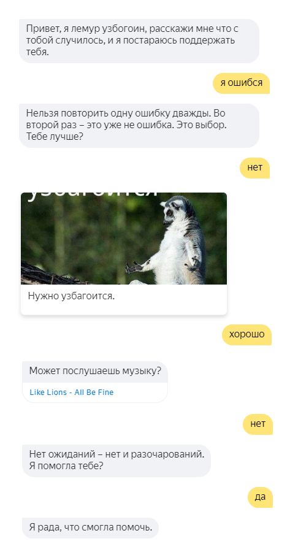

# Лемур успокой меня

[Навык платформы Яндекс.Диалоги](https://dialogs.yandex.ru/store/skills/2140ea06-hakaton-lemur-uspokoj-menya).

Чтобы воспользоваться навыком, скажите Алисе `Запусти навык лемур успокой меня`.

Реализован в рамках хакатона [Алиса в гостях у Контура — хакатон по созданию навыков для голосовых помощников](https://habr.com/company/skbkontur/blog/417419/).

Авторы:
[@KungA](https://github.com/KungA)
[@VeronikaVasilyeva](https://github.com/VeronikaVasilyeva)
[@Zausova](https://github.com/Zausova)
